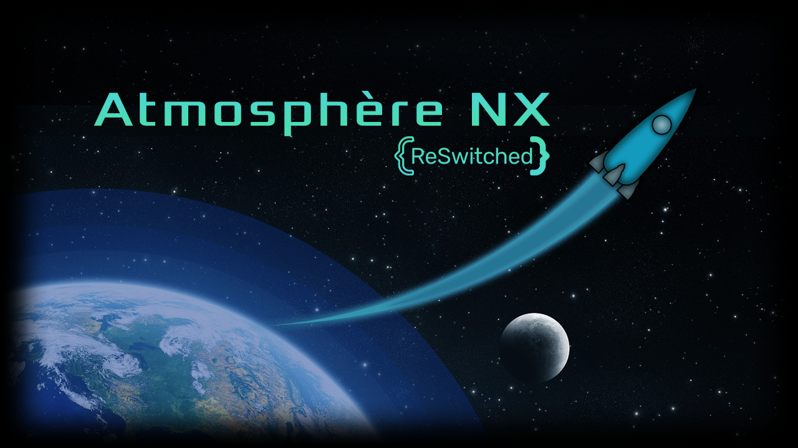
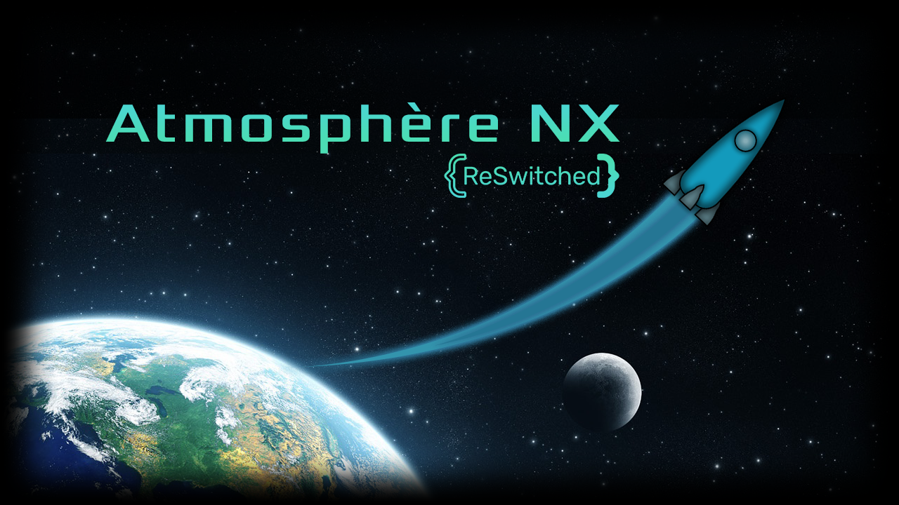
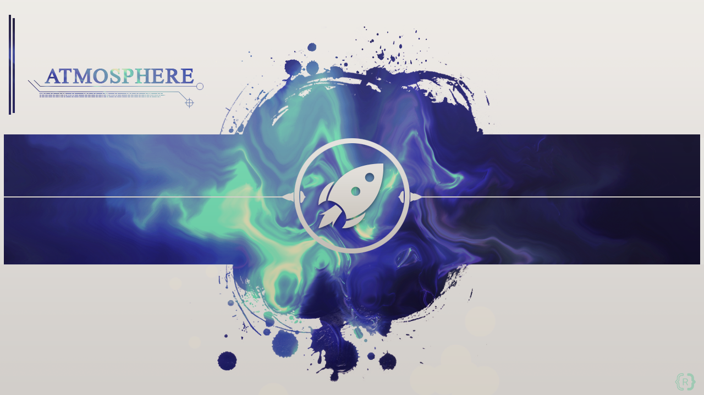
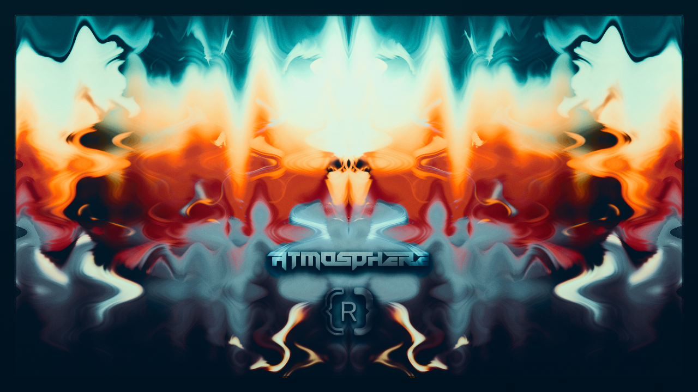
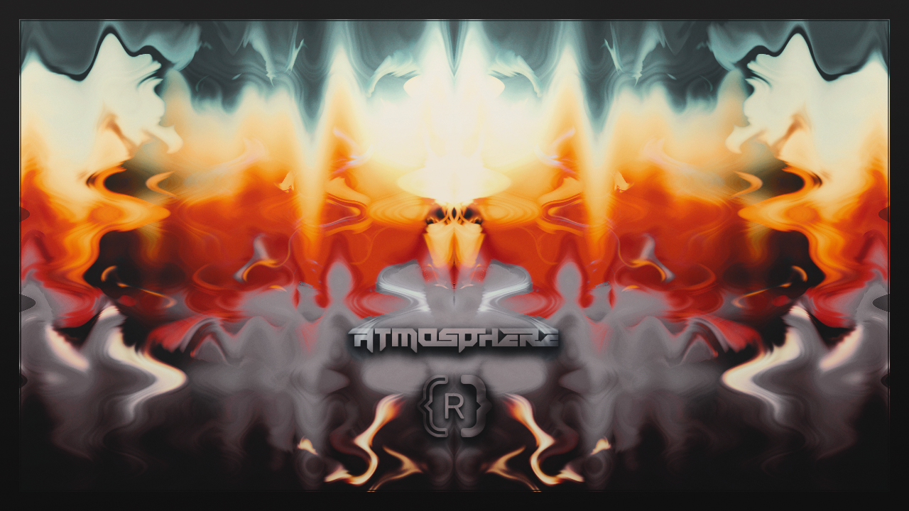
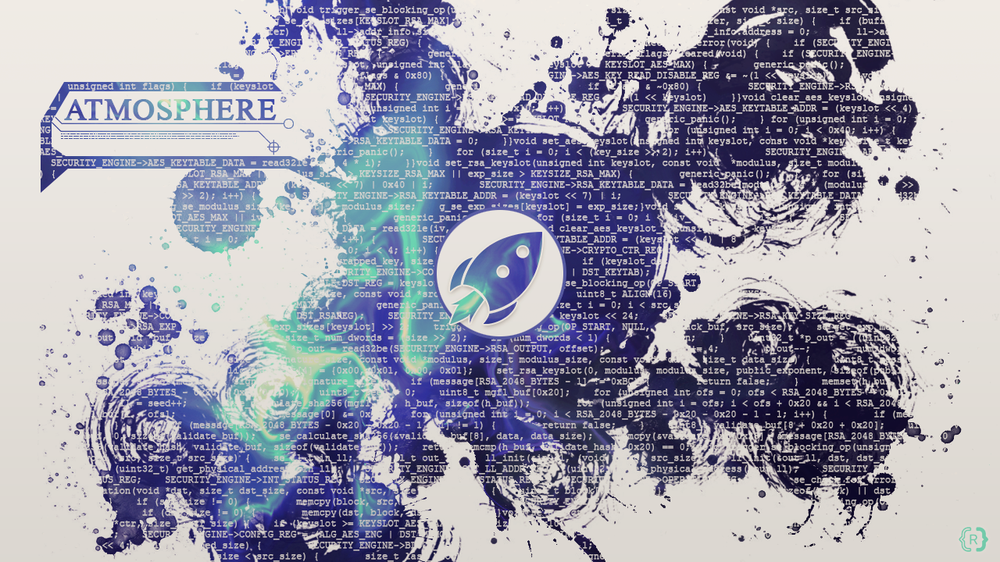

# Atmosphère Splashes

This repo is to track the work on people's splash submissions for [Atmosphère-NX](https://github.com/SciresM/Atmosphere-NX). In-progress submissions can be found in `in_progress`, final submissions are in `final`.

# Contributing

See [contributing guide](CONTRIBUTING.md)

# Final Submissions

### Crusard

**Atmosphere**

**Atmosphere Animated**
[Crusard-Atmosphere-animated](https://raw.githubusercontent.com/Adubbz/Atmosphere-Splashes/master/final/Crusard/Crusard_1.mp4)

### Gerd

### GGLinnk

**Earth With Atmosphere**

**Earth Without Atmosphere**

### Jaames

### MerryMage

### Naby

### NicknameGoesHere

### Retr0id

**Outline**

**Shaded**

**Orbital**

## Swear

NOTE: Other variants can be seen [here](https://github.com/Adubbz/Atmosphere-Splashes/tree/master/final/Swear/README.md)

NOTE: An animation is available for the above:
.

### TheCyberQuake

NOTE: Other variants can be seen [here](https://github.com/Adubbz/Atmosphere-Splashes/tree/master/final/TheCyberQuake/README.md)

**Frozen Rocket**

**Blastoff**

### TheReturningVoid

NOTE: All XCFs provided were created with GIMP 2.9. As a result, latest stable versions (2.8) may be unable to open them.

**Moonlight**

**Vibrant**

### ValliantStorme

**Planet**

**Planet (Geomanist Edit)**

**Space**

# In-Progress Submissions

See [here](https://github.com/Adubbz/Atmosphere-Splashes/tree/master/in_progress/Readme.md) for in-progress submissions.

# Non-Running Submissions

See [here](https://github.com/Adubbz/Atmosphere-Splashes/tree/master/non_running/Readme.md) for non-running submissions. These are for inspiration rather than competing to be Atmosphère's default.
